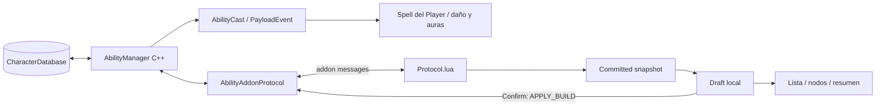

# 01 — Visión del sistema

**VERIFIED FROM ULDUAR SOURCE.** El checkout es AzerothCore para WotLK 3.3.5a.
Identificador observado: `v1.0.1-18944-gd7ce67dc1-dirty`. No es una versión de cliente ni una release limpia.
El addon oficial declara Interface 30300 y versión 1.4.0. El protocolo declara versión 2.

**VERIFIED FROM ASCENSION SOURCE.** La extracción contiene 1.300 archivos en las cinco capas inspeccionadas:
SharedXML 135, FrameXML 378, GlueXML 64, LibraryXML 157 y AddOns 566.
Se enumeraron todas las capas y se leyeron manifiestos, controladores y contratos de los sistemas referenciados.
No se revisó semánticamente cada una de las 823 fuentes Lua: el mapa distingue lectura profunda de muestreo.
La extracción carece de algunos archivos que sus manifiestos incluyen; no equivale a un cliente ejecutable completo.

## Flujo actual Ulduar

El gráfico describe ownership lógico, no threads ni orden de llamadas exacto.
WorldDatabase aporta bindings de scripts/ranks; el cliente aporta nombres/iconos vanilla por SpellID.
Los recursos de UI no transportan reglas de daño.

## Destino y límites

**DESIGN DECISION.** Adoptar infraestructura UI propia y pequeña, primero como addons; reservar los cambios de
FrameXML para integración estable del shell. El árbol de habilidades y su protocolo continúan en una feature.
GlueXML comparte solamente utilidades compatibles con su entorno. No accede a builds de personajes vía addon messages.

Se mantiene una sola definición por habilidad y resolución por rank chain, configuración por GUID y contexto por cast.
SharedXML, UIEditor y assets no pueden convertirse en fuentes de autoridad sobre daño, puntos o elegibilidad.

**RUNTIME TEST REQUIRED.** Visuales Shatter/Chain, tiempos de llegada, audio secundario, taint, vehículos, carga real de
MPQ y comportamiento con otros addons. La auditoría no certifica estos aspectos por inspección estática.
