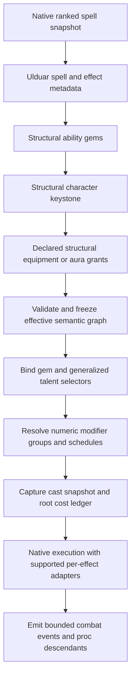

# Ulduar deterministic resolution pipeline

Status: proposed execution contract, 2026-09-14. Existing runtime remains intact.

## Evaluation order

The candidate order is useful, but “Final Ability Metadata before Keystone” is premature when a keystone changes
school, resources or delivery. Split structural compilation from numeric/event evaluation. Talent selectors must
see the stable effective structure, and no selector may recursively depend on a value it modifies.

Normal equipment/aura stat modifiers participate in numeric groups and native combat calculations. The structural
equipment/aura stage exists only for explicit mechanic grants/conversions; ordinary temporary buffs do not rewrite
the catalog or allow the client to alter identity. Such changes advance the relevant semantic revision. Structural
talent effects, if ever needed, require a separate acyclic pre-selector rule tier; v1 talents cannot convert the
same properties used by their own selector. Prefer keystones/gems for those structural changes.

Numeric provenance order for operations in the same stage is base -> gem -> keystone -> talent -> equipment/aura,
then adapter/native outcome modifiers. Actual composition is defined by groups, not incidental callback order.
Replacement conflicts must reject or have an explicit priority policy. Additive percentages in a group sum;
separate multiplicative groups multiply. Flat base changes, coefficient changes and post-scaling multipliers are
different domains and never get combined simply because they affect final damage.

Structural snapshots are immutable. Every cast uses catalogVersion, buildRevision, metadataRevision and compiled
rule IDs. A respec during projectile flight cannot replace that cast's gems. Aura/field/summon effects capture a
snapshot or explicitly use a named dynamic policy. Native behavior is preserved until its adapter documents a
deliberate alternative. Target current health, immunity, LOS and other live legality stay runtime checks.

## Selector binding and numeric evaluation

Bind talent predicates to post-conversion semantic fields: school, kind, temporal model, geometry, tags, resource,
weapon mechanics and supported capabilities. Do not match on an aggregate spell tag union. Numeric threshold
conditions use a declared pre-modifier snapshot or event value, never the final value of a self-modifying property.
Owning a talent registers its rule; matching determines ACTIVE/DORMANT without changing ownership.

For each bound effect, build a modifier ledger keyed by source instance, definition, rank, effectKey, domain and
stage. Resolve shared coverage/duration groups once. Emit concrete adapter operations plus an explanation trace.
Validation reruns after structural keystone changes, including negative gem drawbacks that may lose their axis.

Damage/healing computation must label these bases: native raw base, coefficient contribution, caster done amount,
critical result, target taken/mitigation amount, applied amount and derived proc amount. A talent declares which
base it reads. Legacy `OnHit` primary/secondary scaling remains in its legacy domain until migration; moving it
earlier changes rounding, crit and proc behavior and requires a documented before/after comparison.

## Runtime phases and safety

| Phase | Work and invariant |
| --- | --- |
| Prepare | Validate owned ability, rank, native restrictions and live resources; resolve actor/target |
| Start | Capture cast graph; reserve/debit resources per native timing; OnCastStart once |
| Launch | OnCast once; schedule split siblings; root cooldown/GCD ownership only |
| Acquire | Geometry/propagation resolves finite legal candidates with stable tie-break |
| Dispatch | Resolve GUIDs on map thread; check lifecycle, map, instance, phase and source position |
| Hit | Recheck target legality, LOS, relation, range and native target constraints before side effects |
| Outcome | Core hit/crit/mitigation, supported payload adapter, damage/heal/auras; emit committed events |
| Continue | Successful chain step schedules one successor; no recursive synchronous chain loop |
| Finish | OnCastFinish only on successful completion; controller owns channel lifetime |
| Aura/tick | Tick carries controller snapshot and unique ordinal; refresh uses declared base/phase policy |

Current target checks in
[AbilityTargetResolver.cpp](../../modules/mod-ulduar-abilities/src/AbilityTargetResolver.cpp) preserve independent
enemy/assist relations, exclude peaceful neutrals for Enemy, avoid incidental PvP flagging, and check LOS from
caster and origin. Keep those protections. Current comparator puts unseen targets before revisits, then distance,
then GUID. New geometry adapters must define anchors, dimensional range, LOS and invalidation explicitly.

## Loop, duplicate and scaling prevention

1. **Proc ancestry:** every generated event carries root ID, parent ID, generating rule, effect and subject.
   Default disallows a rule firing from its own descendants, and proc-from-proc requires an explicit policy.
   An A -> B -> A loop is rejected using ancestry, not only immediate-parent comparison.
2. **Finite work:** proposed default ceilings per root: 8 trigger generations, 64 generated casts and 1024 payload
   executions over its lifecycle; per-dispatch work is also bounded. New event IDs/ticks do not reset the root
   budget. Long/permanent controllers use a bounded emission-window budget plus a controller lifetime policy.
   Validate expected tick/target work at compile time where finite. Stop remaining descendants with telemetry
   when a runtime ceiling is reached; never spawn another root to evade it. Legacy Nova parity needs its own
   reviewed cap migration because it currently selects all eligible targets.
3. **Event deduplication:** `(root, event, rule, bound subject/effect)` executes once. Crit/OnDamage views of one
   outcome share its identity. OnKill is emitted once per credited death. Request deduplication is separate.
4. **Propagation:** reserve candidates before dispatch. Visited sets are per payload event; aggregate work is
   per root. Rebounds have minimum hop gap and total execution cap. Miss/immune/reflect/cancel ends a chain
   unless a reviewed strategy says otherwise. Reflection is a core outcome, not a fresh owned ability.
5. **Conversions:** compile a finite DAG, apply each transform once, reject cycles/conflicting writes. No iterative
   “apply until no changes” resolver. Structural talent selectors cannot rewrite their own eligibility fields.
6. **Modifier application:** ledger source IDs prevent the same rank arriving via native aura, Ulduar talent and
   equipment adapter. Publication declares `nativeOwned` or `ulduarOwned` per behavior; do not enable both paths.
7. **Scaling:** derived damage such as Ignite reads a declared post-outcome basis and must not receive the original
   SP/AP coefficient a second time. It may receive explicitly permitted target mitigation under its new damage
   event. Absorb shields and heals use distinct domains. A tick refresh recalculates from native base, not the
   already multiplied stored amount.
8. **Resources:** primary cost, reagent/ammo use and combo/rune consumption occur once in the root ledger.
   Secondary resource generation is opt-in per payload, not copied from the original spell wholesale. Refunds
   state native-base versus actual-paid basis and have a per-root cap where required by their authored rule.
9. **Lifetime:** no delayed raw Player/Unit pointer retention. Use GUID/map/instance and immutable snapshots,
   cancel on invalid ownership/lifecycle. Visual proxies cannot become gameplay casters or proc owners.

Determinism means the same versions, input state, ordered events and random stream produce the same result.
Proc randomness is server-owned and seeded/recorded for replay diagnostics. Equal-distance ordering uses quantized
distance and GUID for new adapters; changing the legacy floating comparator requires its own parity analysis.

## Existing runtime anchors and gaps

[AbilityRuntime.h](../../modules/mod-ulduar-abilities/src/AbilityRuntime.h) already separates `AbilityCast`,
`AbilityPayloadEvent`, `AbilityHit` and `AbilityPropagationContext`. The cast retains GUID, map/instance and ranked
spell; events track visited targets and executions. Keep these concepts and add effect identity, cost/proc ledger
and rule provenance rather than replacing the subsystem.

[AbilitySpellScript.cpp](../../modules/mod-ulduar-abilities/src/AbilitySpellScript.cpp) rejects unrelated triggered
casts as roots, recognizes Arcane Missiles controller payloads through an exact aura, scales damage/healing and
periodic amounts, and suppresses selected secondary resource effects. These protections are useful but do not
constitute a universal trigger bus or a cross-rule recursion budget.

[SecondarySpellExecutor.cpp](../../modules/mod-ulduar-abilities/src/SecondarySpellExecutor.cpp) uses exact Spell*
handoff only during synchronous prepare, then shared event snapshots. Core events own Spell lifetime after prepare.
It retains player attribution, bypasses secondary root costs and uses presentation-only proxies where necessary.
Continue with this adapter boundary; do not introduce proxy-owned gameplay casts for new geometry.

Core school overrides in [Spell.h](../../src/server/game/Spells/Spell.h) are per Spell, not per effect.
Spell family, native aura identity and scripts reading SpellInfo remain native. Generalized school selectors
must not claim fully converted execution where only damage school is overridden.

## Worked interactions and later validation

- A Fire direct spell converted by gems to periodic Frost matches an owned periodic Frost talent after conversion.
  A keystone subsequently converts it to Shadow; the talent becomes DORMANT if no other current effect matches.
- A direct-damage/slow spell receives a damage talent once on its damage effect. Slow strength changes only from
  a control modifier. An aura tag on the slow cannot make the damage count as periodic.
- A crit triggers a bleed; its derived amount is marked already based on damage. The bleed cannot recursively
  trigger the originating talent or debit the attack's cost. Another proc needs an explicit descendant policy.
- A rank change during a launched chain affects later casts, while live target immunity/phase remains rechecked
  for each queued hit. A disconnected caster cancels dispatch without changing persisted ownership.

Implementation acceptance should include two players with different conversions, healing chains, DoT refresh,
weapon finisher resources, shields, summons, defensive events, multi-school effects, cast cancellation, category
cooldown siblings, mutual proc loops, out-of-order packets and work-budget exhaustion. None was executed here.
